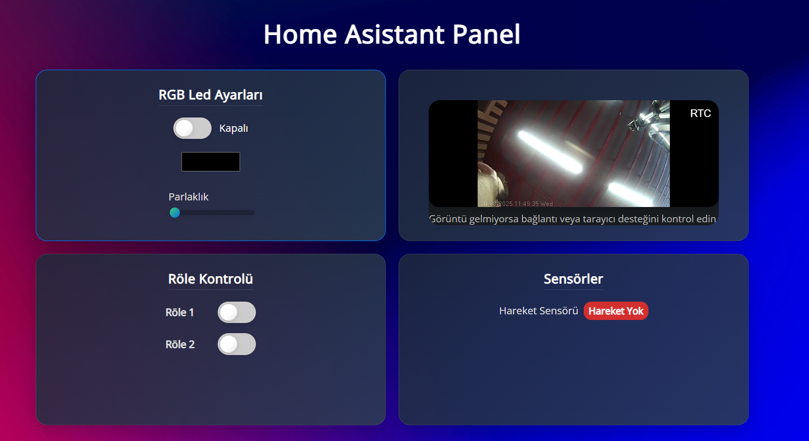

# Akıllı Ev Arayüzü 

Bu proje, bir akıllı ev sistemi için React ile geliştirilmiş, modern ve kullanıcı dostu bir arayüzdür. Sistem, ev otomasyon bileşenlerinin kolayca kontrol edilmesini ve izlenmesini sağlar.

|           Web Arayüz          |
| ------------------------------|
|  |

## Özellikler
- RGB LED Kontrolü: Renk seçimi ve parlaklık ayarlarıyla RGB LED aydınlatmanın tam kontrolünü sağlar.
- Röle Anahtarı Yönetimi: Cihazları uzaktan açıp kapatmak için röle anahtarlarını kontrol eder.
- Sensör Durumu İzleme: Hareket ve kapı sensörleri gibi çeşitli sensörlerin anlık durum bilgilerini görüntüler.
- Canlı Kamera Görüntüsü: go2rtc entegrasyonu sayesinde IP kameralardan canlı video akışını doğrudan arayüzde izleme imkanı sunar.
- MQTT Entegrasyonu: Tüm cihaz ve sensör verilerini merkezi bir MQTT broker üzerinden yönetir.

## Teknolojiler
- Frontend: React
- Akıllı Ev Serverları: OpenHAB, Zigbee2MQTT
- Donanım: Orange Pi 3 LTS
- İletişim Protokolü: MQTT
- Kamera Entegrasyonu: go2rtc

## Sistem Mimarisi
- *Bu proje, birden fazla bileşenin bir araya geldiği bir ekosistem üzerinde çalışır.*
- Donanım: Projenin beyni, akıllı ev sunucularını barındıran *Orange Pi 3 LTS'dir.*
- Serverlar: Orange Pi üzerinde kurulu olan *OpenHAB* ve *Zigbee2MQTT* sunucuları, Zigbee cihazları ve diğer akıllı ev bileşenlerini yönetir.
- Haberleşme: Tüm cihazlar (sensörler, anahtarlar) ile OpenHAB ve Zigbee2MQTT sunucuları arasındaki veri akışı, kurulan bir *MQTT broker* üzerinden sağlanır.
- Kamera: *go2rtc* ile IP kameralar sisteme entegre edilmiştir.
- Kullanıcı Arayüzü: Bu React uygulaması, MQTT broker'a kayıtlı tüm cihaz ve sensör verilerini alır ve kullanıcı dostu bir arayüzde sunar. Kullanıcı komutları, yine MQTT broker aracılığıyla ilgili cihazlara iletilir.

## Kurulum
- Gerekli OpenHAB, Zigbee2MQTT ve MQTT broker sunucularını Orange Pi 3 LTS cihazınıza kurun.
- Zigbee cihazlarınızı (sensörler, anahtarlar) Zigbee2MQTT'ye entegre edin.
- Proje dizininde aşağıdaki komutları çalıştırarak bağımlılıkları yükleyin ve projeyi başlatın:

### Bash
```
npm install
npm start
```
## İletişim
Proje hakkında daha fazla bilgi almak veya geliştirmeye katkıda bulunmak için *msamedcagli@gmail.com* mailim üzerinden ulaşabilirsiniz.
